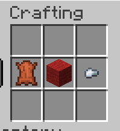
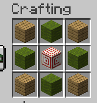

# Minecraft Dart Mod

A simple, turn-based darts mini-game for Minecraft 1.21.1 using NeoForge. You can now play darts by yourself or with friends in Minecraft! 

Built for the [Sprint.dev Minecraft Hackathon](https://www.sprint.dev/hackathons/minecrafthack).

---

## Overview

- **Dart**: A throwable dart (mix of trident+arrow)  
- **Dart Board Block**: Custom target block that calculates a 0–15 score based on hit position  
- **Scoreboard**: `/dart challenge <rounds> [player]` to start, `/dart stop` to end  
- **Solo or PvP**: Play by yourself or challenge a friend  

---

## Installation

1. **Clone the repo**  
   ```bash
   git clone https://github.com/your-org/partygames-minecraft-dart.git
   cd partygames-minecraft-dart
   ```
2. **Open the project**  
   IntelliJ IDEA is recommended  
3. **Refresh & build**  
   ```bash
   ./gradlew --refresh-dependencies
   ./gradlew clean build
   ```

   Or run gradle tasks right in IntelliJ
4. **Run**  
   Launch your development environment or drop the generated JAR into your mods folder.

---

## Crafting Recipes

- **Dart**  
  

- **Dart Board**  
  

---

## Usage

1. Craft a Dart Board block in the world.  
2. Craft some Darts 
3. Start the game:  
   - Solo:  
     ```
     /dart challenge <rounds>
     ```  
   - PvP:  
     ```
     /dart challenge <rounds> <otherPlayer>
     ```  
   This resets both scores to 0 and displays “Dart Score” in the sidebar.  
4. Throw darts by charging the Dart (hold right-click) and releasing at the board.  
5. Score updates automatically after each hit.  
6. Stop anytime:  
   ```
   /dart stop
   ```  
   This removes the scoreboard and ends the game.

---


## Credits

- **Joey0980 (Joey)** – Set up the project, made the Dart and DartEntity
- **grcodeman (Cody)** – Created Dart Board block, designed scoring system
- **calvinb552 (Calvin)** – Designed and modeled block and dart assets & textures  
